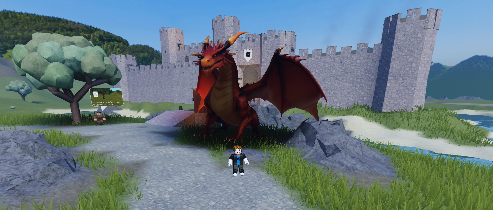

# falblox

Generate 3D models from text or images directly inside Roblox Studio. Powered by [fal.ai](https://fal.ai) running [Tripo P1](https://fal.ai/models/tripo3d/p1/image-to-3d).

<!-- Drop your fire dragon screenshot at docs/demo.png and commit it. -->


## Install

1. Get a fal API key at [fal.ai/dashboard/keys](https://fal.ai/dashboard/keys).
2. Download [`falgen.lua`](./falgen.lua).
3. Move it to your Roblox Plugins folder:
   - Windows: `%LOCALAPPDATA%\Roblox\Plugins\`
   - macOS: `~/Documents/Roblox/Plugins/`
4. Restart Roblox Studio.
5. Open any place. Click the new **falgen** button in the Plugins tab.
6. Paste your fal API key into the widget and click **Save fal key**.

## Use

**Text to 3D**
1. Type a prompt.
2. Click **Generate from text**. Wait 30 to 90 seconds.

**Image to 3D**
1. Click **Pick image from disk**, select a PNG/JPG/WEBP under 4 MB. The plugin uploads it to fal storage automatically.
2. Click **Generate from image**.

**Drop the GLB into your scene**
1. Copy the GLB URL from the widget. Paste into a browser and press Enter to download the file.
2. Drag the `.glb` onto Studio's viewport. The 3D Importer dialog opens.
3. Click **Import**. The mesh appears in Workspace with PBR textures.

The plugin sets `face_limit: 9000` so meshes fit Roblox's 10,000 triangle MeshPart cap.

## Why the manual import step?

Studio's plugin sandbox blocks both ways to skip the drag step:

- `AssetService:CreateMeshPartAsync(Content.fromUri(...))` only accepts Roblox CDN URLs, not arbitrary hosts like `fal.media`.
- `HttpService` blocks `apis.roblox.com`, so the plugin cannot upload the GLB via Open Cloud either.

The drag-drop step takes about 5 seconds and preserves PBR textures, so the plugin handles generation and the GLB handoff while Studio's native importer does the rest.

## How it works

```
prompt or image
    v
plugin POSTs to queue.fal.run/tripo3d/p1/{text,image}-to-3d
    v
plugin polls status_url until COMPLETED
    v
GET response_url returns a GLB URL
    v
[manual] download the GLB, drag onto Studio viewport
```

For Image to 3D, the file is read with `StudioService:PromptImportFile`, uploaded to fal storage via `rest.fal.ai/storage/upload/initiate`, and the resulting URL is submitted to Tripo.

## Security

- Your fal API key is stored locally via `plugin:SetSetting` in plaintext on disk. Same threat model as a `.env` file.
- The key is sent only to `queue.fal.run` and `rest.fal.ai`. Both URLs are hardcoded.
- Plugin settings are isolated between plugins by Roblox, but a malicious co-installed plugin could read the file off disk. Only install Studio plugins you trust.
- This repo ships with no key. Each user pastes their own.

## Costs

You pay fal directly for each generation. See [Tripo P1 pricing](https://fal.ai/models/tripo3d/p1/image-to-3d) and add credits at [fal.ai/dashboard/billing](https://fal.ai/dashboard/billing).

## Limitations

- 10,000 triangle cap per MeshPart in Roblox. The plugin requests `face_limit: 9000`.
- Local image uploads capped at 4 MB.
- Studio plugin only. Will not work in published games at runtime.

## License

MIT.

Built with [fal.ai](https://fal.ai) and [Tripo](https://www.tripo3d.ai/).
