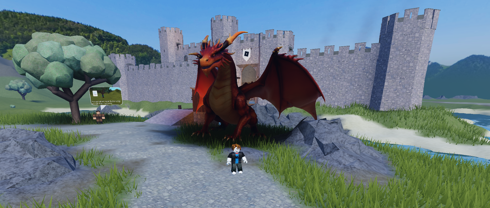

# falblox

A Roblox Studio plugin for generating game-ready assets with [fal.ai](https://fal.ai), without leaving the editor. Generate and edit images, turn them into 3D models, create tiling PBR materials for parts and terrain, and produce video for in-experience screens. Every generation step offers a Fast tier (quick and cheaper) and a Quality tier (higher fidelity).



<!-- more screenshots and demo clips to be added later -->

## What it does

The plugin is organized into tabs:

- **Settings**: store your fal API key and pick the global quality tier (Fast or Quality), which applies to every image and video generation.
- **Image**: generate an image from a prompt, edit it with further prompts, or load one from disk. Choose an aspect ratio, plus a resolution on the Quality tier. The current image is shared across the 3D, Material, and Video tabs, so one art-directed image can drive everything. Click any preview to enlarge it.
- **3D**: generate a mesh from a text prompt or from the current image. The plugin returns a GLB that you import through Studio's native 3D Importer, then optionally wrap an imported mesh into an equippable **Tool** (scaled to hand size, with a left-click swing script).
- **Material (PATINA)**: turn a prompt or the current image into a seamless tiling PBR material (base color, normal, roughness, metalness). Apply it to a selected part, or override a built-in material to re-skin entire terrain. Tiling scale is tunable live after applying.
- **Video**: generate a clip from a prompt or the current image, then play it on a part's surface as an in-experience screen.

### Quality tiers

The Fast/Quality toggle in Settings selects the model used for each modality:

| Modality | Fast | Quality |
| --- | --- | --- |
| Image | z-image turbo | nano-banana 2 |
| Video | LTX-2.3 | Seedance 2.0 |

3D uses Tripo P1 and materials use PATINA in both tiers.

## Install

1. Get a fal API key at [fal.ai/dashboard/keys](https://fal.ai/dashboard/keys).
2. Download [`falgen.lua`](./falgen.lua).
3. Move it to your Roblox Plugins folder:
   - Windows: `%LOCALAPPDATA%\Roblox\Plugins\`
   - macOS: `~/Documents/Roblox/Plugins/`
4. Restart Roblox Studio.
5. Open any place and click the **falgen** button in the Plugins tab.
6. Paste your fal API key into the Settings tab and click **Save fal key**.

Two features rely on Studio betas (File > Beta Features, then restart):

- **CreateAssetAsync Lua API**: required to apply materials, since the plugin uploads the PBR maps as image assets.
- **Universal Importer** (or the Asset Manager): used for the manual video import step.

## Use

### Image

1. In Settings, pick Fast or Quality.
2. On the Image tab, set an aspect ratio, plus a resolution on Quality.
3. Type a prompt and click **Generate image**, or use **Load image from disk**.
4. Refine with the edit prompt and **Edit current image**, or **Reset to original**.

The result becomes the current image and appears on the 3D, Material, and Video tabs. Click any preview to view it full size.

### 3D

1. **Generate from text**, or **Generate 3D from current image**. Generation takes roughly 30 to 90 seconds.
2. Copy the GLB URL from the widget, paste it into a browser, and download the file.
3. Drag the `.glb` onto Studio's viewport and click **Import** in the 3D Importer.

The plugin requests `face_limit: 9000` so meshes fit Roblox's 10,000 triangle MeshPart cap.

**Make it equippable (optional):** select the imported mesh and click **Wrap selected mesh as Tool**. It scales to hand size, adds a swing script (left-click while equipped), and goes into StarterPack, so you press 1 in playtest to equip. Use the grip rotate buttons (or a dedicated grip editor) to fine-tune how it sits in the hand.

### Material (PATINA)

1. **Generate material from text**, or **Material from current image**.
2. Choose **Apply to**:
   - **Selected part**: select one or more parts (or a Model, which applies to all parts inside it) and apply to them all at once. Best on flat surfaces, where a floor or plaza slab tiles cleanly.
   - **Terrain**: pick the built-in material to override (Grass, Rock, Sand, and so on). This re-skins all geometry using that material (terrain and any parts set to it), which turns a whole-terrain or same-material re-skin into a single click.
3. Tune **Studs / tile** at any time. It updates the applied material live, with no re-generation.
4. **Reset terrain overrides** reverts terrain to its original materials.

Materials look best on terrain and single flat surfaces. Tiling across many separate parts can show seams at part boundaries, which is how Roblox projects surface materials in general, not specific to this plugin.

### Video

1. In Settings, pick Fast or Quality. Set duration, resolution, aspect, and audio on the Video tab.
2. **Generate from text**, or **Generate from current image** with a motion description.
3. Open the resulting `.mp4` link, download it, and import it through Studio's Universal Importer.
4. Paste the resulting asset id into the plugin, select a part, and click **Play on selected part**. The plugin builds a SurfaceGui and VideoFrame on the part's largest face and previews it at edit time.

Roblox plays video at up to 720p, and at most two videos at once. The Quality tier (Seedance) generates native 720p; the Fast tier (LTX) starts at 1080p, which Roblox downscales.

## Manual steps, and why

Two handoffs are manual because of Roblox platform limits, not plugin design:

- **3D import**: `CreateMeshPartAsync(Content.fromUri(...))` only accepts Roblox CDN URLs, not hosts like `fal.media`, and `HttpService` blocks `apis.roblox.com`, so the plugin cannot upload the GLB through Open Cloud either. Studio's native importer handles the GLB in a few seconds and preserves PBR textures.
- **Video upload**: `AssetService:CreateAssetAsync` supports image, mesh, model, and plugin assets, but not video. Video can only be uploaded through the manual importer or Open Cloud, which a plugin cannot reach. Uploading a video also requires an ID-verified account, costs 2,000 Robux per upload, and goes through moderation, so a freshly uploaded clip will not play until it is approved.

## How it works

```
prompt or image
    v
plugin POSTs to queue.fal.run/<model>
    v
plugin polls status_url until COMPLETED
    v
GET response_url returns the result (image, GLB, material maps, or video URL)
```

- Images are returned as PNG, decoded in pure Luau, and shown through an EditableImage.
- Materials decode the PBR maps, upload them with `CreateAssetAsync`, and build a `MaterialVariant`. Terrain re-skins use `MaterialService:SetBaseMaterialOverride`.
- Video is placed with a SurfaceGui and VideoFrame on the selected part.

## Security

- Your fal API key is stored locally via `plugin:SetSetting` in plaintext on disk. Same threat model as a `.env` file.
- The key is sent only to `queue.fal.run` and `rest.fal.ai`. Both are hardcoded.
- This repo ships with no key. Each user pastes their own.
- Only install Studio plugins you trust. A malicious co-installed plugin could read settings off disk.

## Costs

You pay fal directly per generation, and Roblox charges 2,000 Robux per video upload. See [fal pricing](https://fal.ai/pricing) and add credits at [fal.ai/dashboard/billing](https://fal.ai/dashboard/billing).

## Limitations

- 3D and video imports are manual, as described above.
- 10,000 triangle cap per MeshPart. The plugin requests `face_limit: 9000`.
- Local image uploads are capped at 4 MB.
- Video plays at up to 720p, two clips at once, and requires an ID-verified account.
- Studio plugin only. It does not run in published games at runtime.

## License

MIT.

Built with [fal.ai](https://fal.ai), [Tripo](https://www.tripo3d.ai/), and [PATINA](https://fal.ai/models/fal-ai/patina).
